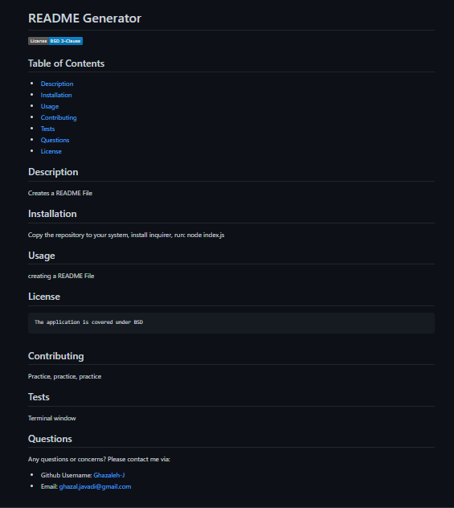

# README_Generator_NodeJS-9

## Description:

When creating an open source project on GitHub, it’s important to have a high-quality README for the app. This should include what the app is for, how to use the app, how to install it, how to report issues, and how to make contributions.
In this project, I created a command-line application that dynamically generates a professional README.md file from a user's input using the Inquirer package.

## Criteria:

* A command-line application that accepts user input and generates a high-quality, professional README.md

* A title of the user's project and sections entitled Description, Table of Contents, Installation, Usage, License, Contributing, Tests, and Questions are presented

* The description, installation instructions, usage information, contribution guidelines, and test instructions
are added to the sections of the README entitled Description, Installation, Usage, Contributing, and Tests

* When the user  chooses a license for their application from a list of options
then a badge for that license is added near the top of the README and a notice is added to the section of the README entitled License that explains which license the application is covered under

* The user's GitHub username is added to the section of the README entitled Questions, with a link to the user's GitHub profile

* The user's email address is added to the section of the README entitled Questions, with instructions on how to reach them with additional questions

* The links in the Table of Contents takes you to the corresponding section of the README

 ##  [Link](https://drive.google.com/file/d/16o_JdF5Q6zOr1Wcq8B4eTXHnW3hJxqaT/view) to the walkthrough video that demonstrates functionality of the app

## README Preview:

